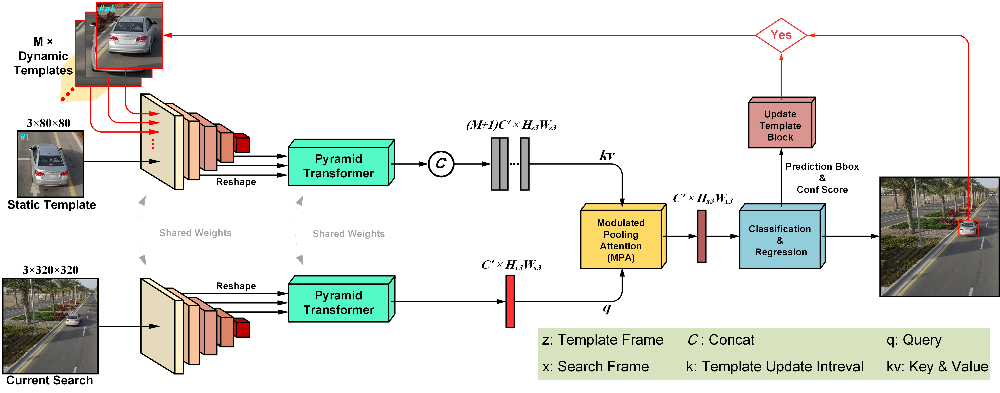

# T-SiamTPNTracker
Temporal Siamese Transformer Pyramid Networks for Robust and Efficient UAV Tracking

## Abstract

Aerial object tracking is one of the key challenges in computer vision due to dynamic environmental conditions, occlusion, scale variation, and complex scenes, requiring advanced approaches. Existing trackers are predominantly limited to spatial information and fail to leverage temporal information between frames effectively. This limitation reduces their performance in long-term tracking where significant changes occur in the target's appearance and background. Moreover, in the face of occlusion, they lack the ability to recover the target accurately. Additionally, Siamese-based architectures, which rely on correlation operations to combine features of the template and search region branches, face difficulties in handling complex and nonlinear changes in the target’s appearance due to the linear nature of correlation operations. In this research, a novel model named T-SiamTPN is proposed, built upon a Siamese architecture that combines Convolutional Neural Networks (CNNs) and Transformers. The model introduces a temporal mechanism to utilize temporal information between frames, improving robustness and accuracy in tracking. Furthermore, by replacing the correlation operation with an attention mechanism, T-SiamTPN effectively models the interactions between the template and search region branches with higher precision. The proposed model was evaluated on six standard UAV tracking benchmarks. Results demonstrate that T-SiamTPN achieves an average success rate of 62.9% and precision of 83.8%, outperforming comparable trackers with significant improvements of 9% and 9.6% over the second-best tracker, respectively. Additionally, the model was successfully implemented on the Nvidia Jetson Nano platform, achieving an average speed of 7.1 FPS, demonstrating its suitability for resource-constrained environments. 


This figure shows the architecture of our tracker

[\[Paper\]](https://arxiv.org/abs/2110.08822)  
[\[Raw results\]](https://drive.google.com/drive/folders/1y1PmKakoFSbsCYx4bRwYCFDMOdiU-sZi?usp=sharing)   
[\[Demo examples\]](https://drive.google.com/drive/folders/1QUn6HPVdNEwVeKrLSAlKs2pYWznYXgel?usp=sharing)  
[\[Weights\]](https://drive.google.com/drive/folders/1JhSDKl2X0juaInFwIlD1bILGowq4l2fa?usp=sharing)  
[\[Training logs\]](https://drive.google.com/drive/folders/1tPP0s88oAtONEjVDw1XhiZ_Hy7d34WsB?usp=sharing)

## Requirements
Install the dependency packages using the environment file  `./install_requirement.sh`.

```
pip install -r requirements.txt
```

## Training

### prepare data

Put the tracking datasets in dataset_path. It should look like:
   ```
    -- dataset_path
        -- lasot
            |-- airplane
            |-- basketball
            |-- bear
            ...
        -- got10k
            |-- test
            |-- train
            |-- val
        -- coco
            |-- annotations
            |-- images
        -- trackingnet
            |-- TRAIN_0
            |-- TRAIN_1
            ...
            |-- TRAIN_11
            |-- TEST
   ```

Then change the path in `lib/train/admin/local.py ` to your data location


### Single gpu training:

```
python tools/run_training.py --config tpn_st
```


## Test and evaluate SiamTPN

### prepare data
change the path in `lib/test/evaluation/local.py ` to your data location

Download the pretrain model and put it under ./results/checkpoints/train/tpn_st/ folder

```
#save perdiction bbox:
python tools/test.py siamtpn_st tpn_st --dataset_name [dataset_name] --debug 0 --epoch 300

#visual:
python tools/test.py siamtpn_st tpn_st --dataset_name [dataset_name] --debug 1 --epoch 300
```

## analysis results:

```
python tools/analysis_results.py siamtpn_st tpn_st --dataset_name [dataset_name] 
```

## Evaluation of model parameters & FLOPs
```
python script/model_detail_1.py
python script/model_detail_flops.py
```

## Tracker demo
To evaluate the tracker on a sample video, run
```
python tools/demo.py siamtpn_st tpn_st --video_name [path-to-video-file] 
```

## Qualitative Evaluation


## Citation
If you find this repo useful, please cite with
```

```


## Acknowledge
Our code is implemented based on the following libraries:
* [Stark](https://github.com/researchmm/Stark)
* [SiamTPN](https://github.com/RISC-NYUAD/SiamTPNTracker)


